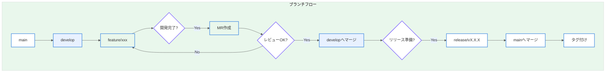

# Section 3: GitLab 初期設定・運用ガイド

本ドキュメントは、自動運転システム（ADS）開発プロジェクトにおけるGitLab運用ガイドを記載する。

---

## 1. リポジトリ構成方針

### 1.1 Redmineプロジェクトとの対応関係

Redmineの子プロジェクト（01～04）と1対1でリポジトリを作成する。

| Redmineプロジェクト | GitLabリポジトリ | 説明 |
|--------------------|------------------|------|
| 00_SystemDesign | `ads-system-design` | アーキテクチャ設計、I/F仕様書 |
| 01_Perception | `ads-perception` | 認知モジュール（AI/カメラ） |
| 02_Planning | `ads-planning` | 経路計画モジュール |
| 03_Embedded | `ads-embedded` | 組込みソフトウェア |
| 04_QA | `ads-qa` | テストスクリプト、シミュレーション |

### 1.2 GitLabグループ構成

```
ADS (グループ)
├── ads-system-design (リポジトリ)
├── ads-perception (リポジトリ)
├── ads-planning (リポジトリ)
├── ads-embedded (リポジトリ)
├── ads-qa (リポジトリ)
└── ads-common (共通ライブラリ - オプション)
```

### 1.3 リポジトリ作成手順

1. GitLabにログインする
2. 「Groups」→「ADS」グループを選択する
3. 「New project」→「Create blank project」を選択する
4. 以下の設定でリポジトリを作成する
   - Project name: `ads-perception`（例）
   - Project slug: `ads-perception`
   - Visibility Level: Private
   - Initialize repository with a README: チェックする
5. 「Create project」をクリックする

---

## 2. ディレクトリ構成ルール

### 2.1 標準ディレクトリ構成

各リポジトリは以下の標準ディレクトリ構成に従うこと。

```
ads-{module}/
├── src/                    # ソースコード
│   ├── main/              # メインコード
│   │   ├── cpp/           # C++ソース（組込み向け）
│   │   ├── python/        # Pythonソース（AI向け）
│   │   └── include/       # ヘッダファイル
│   └── test/              # テストコード
│       ├── unit/          # 単体テスト
│       └── integration/   # 結合テスト
├── docs/                   # ドキュメント（Docs as Code）
│   ├── design/            # 設計書
│   │   ├── architecture/  # アーキテクチャ設計
│   │   └── detailed/      # 詳細設計
│   ├── api/               # API仕様書
│   └── guides/            # 手順書・ガイド
├── tests/                  # テスト関連（テストデータ等）
│   ├── data/              # テストデータ
│   └── scripts/           # テストスクリプト
├── tools/                  # ビルド・開発ツール
├── config/                 # 設定ファイル
├── .gitlab-ci.yml          # CI/CD設定
├── .gitignore              # Git除外設定
├── README.md               # リポジトリ説明
└── CHANGELOG.md            # 変更履歴
```

### 2.2 モジュール別のディレクトリカスタマイズ

| モジュール | 追加ディレクトリ | 用途 |
|-----------|-----------------|------|
| 01_Perception | `models/` | 機械学習モデル（Git LFS使用） |
| 01_Perception | `datasets/` | 学習データセット参照（リンクのみ） |
| 02_Planning | `maps/` | 地図データ |
| 03_Embedded | `hw_specs/` | ハードウェア仕様 |
| 04_QA | `scenarios/` | テストシナリオ |
| 04_QA | `simulation/` | シミュレーション設定 |

---

## 3. Docs as Code運用

### 3.1 基本方針

機能設計書をMarkdownで作成し、GitLabの `/docs` ディレクトリに格納する。

**メリット**:
- バージョン管理による変更履歴の追跡
- コードレビューと同じフローでのドキュメントレビュー
- CI/CDによる自動検証（リンク切れ、形式チェック等）

### 3.2 ドキュメント形式

| ドキュメント種別 | ファイル形式 | 格納先 | 命名規則 |
|----------------|-------------|--------|----------|
| 機能設計書 | Markdown | `/docs/design/` | `FD_{機能名}.md` |
| 詳細設計書 | Markdown | `/docs/design/detailed/` | `DD_{機能名}.md` |
| API仕様書 | OpenAPI/Markdown | `/docs/api/` | `API_{サービス名}.yaml` |
| 手順書 | Markdown | `/docs/guides/` | `GUIDE_{手順名}.md` |

### 3.3 ドキュメントテンプレート

#### 3.3.1 機能設計書テンプレート（FD_*.md）

```markdown
# 機能設計書: [機能名]

## 文書情報

| 項目 | 内容 |
|------|------|
| 文書ID | FD-XXX-001 |
| バージョン | v1.0.0 |
| 作成者 | [名前] |
| 作成日 | YYYY-MM-DD |
| 承認者 | [名前] |
| 承認日 | YYYY-MM-DD |
| Redmineチケット | #XXX |

## 変更履歴

| バージョン | 日付 | 変更者 | 変更内容 |
|-----------|------|--------|----------|
| v1.0.0 | YYYY-MM-DD | [名前] | 初版作成 |

---

## 1. 概要

### 1.1 目的
[この機能の目的を記載]

### 1.2 スコープ
[この設計書の対象範囲を記載]

### 1.3 関連ドキュメント
- システム要件定義書: [リンク]
- 上位設計書: [リンク]

---

## 2. 機能要件

### 2.1 機能一覧

| ID | 機能名 | 説明 | 優先度 |
|----|--------|------|--------|
| F-001 | [機能名] | [説明] | 必須 |

### 2.2 機能詳細

#### 2.2.1 F-001: [機能名]

**入力**: [入力データの説明]

**処理**: [処理内容の説明]

**出力**: [出力データの説明]

---

## 3. 非機能要件

### 3.1 性能要件
- 処理時間: XX ms以内
- スループット: XX TPS以上

### 3.2 信頼性要件
- ASIL レベル: [QM/A/B/C/D]
- 可用性: XX%

---

## 4. インターフェース設計

### 4.1 外部インターフェース

[入出力の図を記載]

### 4.2 データフォーマット

```json
{
  "field1": "type",
  "field2": "type"
}
```

---

## 5. 制約事項

[設計上の制約、前提条件を記載]

---

## 6. 用語定義

| 用語 | 定義 |
|------|------|
| [用語1] | [定義] |

```

### 3.4 Redmineとの連携ルール

#### 3.4.1 コミットメッセージのフォーマット

```
[種別] 変更内容の要約 #チケットID

詳細な変更内容（任意）

refs #チケットID（参照のみ）
fixes #チケットID（解決）
```

**種別一覧**:

| 種別 | 用途 | 例 |
|------|------|-----|
| `feat` | 新機能追加 | `[feat] 物体検出機能を追加 #123` |
| `fix` | バグ修正 | `[fix] 境界値処理を修正 fixes #456` |
| `docs` | ドキュメント更新 | `[docs] API仕様書を更新 #789` |
| `refactor` | リファクタリング | `[refactor] センサー処理を最適化 refs #101` |
| `test` | テスト追加・修正 | `[test] 単体テストを追加 #102` |
| `chore` | ビルド・設定変更 | `[chore] CI設定を更新` |

#### 3.4.2 Redmine自動連携

以下のキーワードをコミットメッセージに含めることで、Redmineチケットと自動連携する。

| キーワード | 動作 |
|-----------|------|
| `refs #123` | チケット#123を参照（コメント追加） |
| `fixes #123` | チケット#123を解決済みに変更 |
| `closes #123` | チケット#123をクローズ |

---

## 4. ブランチ戦略

### 4.1 ブランチ命名規則

```
{種別}/{チケットID}_{簡潔な説明}
```

| 種別 | 用途 | 例 |
|------|------|-----|
| `feature` | 新機能開発 | `feature/123_object_detection` |
| `bugfix` | バグ修正 | `bugfix/456_boundary_fix` |
| `hotfix` | 緊急修正 | `hotfix/789_critical_crash` |
| `release` | リリース準備 | `release/v1.0.0` |
| `docs` | ドキュメント更新 | `docs/101_api_spec_update` |

### 4.2 ブランチフロー



### 4.3 ブランチ保護設定

| ブランチ | 保護設定 |
|---------|----------|
| `main` | 直接プッシュ禁止、MR必須、2名以上の承認必須 |
| `develop` | 直接プッシュ禁止、MR必須、1名以上の承認必須 |
| `release/*` | 直接プッシュ禁止、MR必須 |

---

## 5. マージリクエスト（MR）運用

### 5.1 MR作成ルール

1. MRタイトルは「[種別] 変更内容の要約 #チケットID」形式で記載する
2. MR説明には以下を含める
   - 変更の背景・目的
   - 変更内容の概要
   - テスト結果
   - 関連するRedmineチケットへのリンク
3. レビュアーを必ず指定する
4. CI/CDパイプラインが成功していることを確認する

### 5.2 MRテンプレート

```markdown
## 変更概要
<!-- 変更内容を簡潔に記載 -->

## 関連チケット
- Redmine: #XXX

## 変更種別
- [ ] 新機能 (feature)
- [ ] バグ修正 (bugfix)
- [ ] ドキュメント (docs)
- [ ] リファクタリング (refactor)
- [ ] テスト (test)

## 変更内容
<!-- 詳細な変更内容を記載 -->

## テスト結果
- [ ] 単体テストがパスすること
- [ ] 結合テストがパスすること
- [ ] 手動テストを実施したこと

## レビュー観点
<!-- レビュアーに特に見てほしい点を記載 -->

## スクリーンショット（該当する場合）
<!-- UI変更がある場合はスクリーンショットを添付 -->
```

---

## 6. CI/CD設定

### 6.1 基本CI/CD設定（.gitlab-ci.yml）

```yaml
stages:
  - lint
  - build
  - test
  - deploy

variables:
  GIT_SUBMODULE_STRATEGY: recursive

# 静的解析
lint:
  stage: lint
  image: python:3.10
  script:
    - pip install flake8 mypy
    - flake8 src/
    - mypy src/
  only:
    - merge_requests
    - develop
    - main

# ビルド
build:
  stage: build
  image: gcc:latest
  script:
    - mkdir build && cd build
    - cmake ..
    - make -j$(nproc)
  artifacts:
    paths:
      - build/
    expire_in: 1 week
  only:
    - merge_requests
    - develop
    - main

# 単体テスト
unit_test:
  stage: test
  image: gcc:latest
  dependencies:
    - build
  script:
    - cd build
    - ctest --output-on-failure
  coverage: '/Total.*?([0-9]{1,3})%/'
  only:
    - merge_requests
    - develop
    - main

# ドキュメント検証
docs_check:
  stage: lint
  image: node:18
  script:
    - npm install -g markdownlint-cli
    - markdownlint docs/**/*.md
  only:
    - merge_requests
    - develop
    - main
```

---

## 7. GitLab設定チェックリスト

### 7.1 リポジトリ初期設定

- [ ] リポジトリが正しいグループに作成されていること
- [ ] README.mdが配置されていること（Section 4参照）
- [ ] .gitignoreが配置されていること
- [ ] ディレクトリ構成が標準に従っていること
- [ ] ブランチ保護が設定されていること
- [ ] MRテンプレートが設定されていること

### 7.2 CI/CD設定

- [ ] .gitlab-ci.ymlが配置されていること
- [ ] lint/build/testステージが動作すること
- [ ] Redmine連携が設定されていること

---

*本ドキュメントはGitLab運用ガイドである。README.mdテンプレートについてはSection 4を参照すること。*
