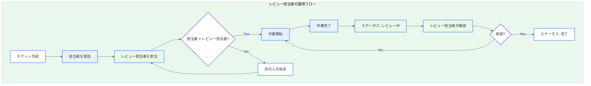

# Section 1.5: Redmine カスタムフィールド定義

本ドキュメントは、自動運転システム（ADS）開発プロジェクトで使用するRedmineカスタムフィールドの定義と設定手順を記載する。

---

## 1. カスタムフィールド一覧

| フィールド名 | 形式 | 対象トラッカー | 必須/任意 | 用途 |
|-------------|------|----------------|----------|------|
| ASILレベル | リスト | エピック、ストーリー | **必須** | 機能安全レベルの指定 |
| 混入工程 | リスト | バグ | **必須** | 不具合の混入フェーズ特定 |
| 根本原因 | リスト | バグ | 任意 | 不具合の根本原因分類 |
| レビュー担当者 | ユーザー | タスク、成果物 | **必須** | 成果物の承認者指定 |

---

## 2. ASILレベル (Safety Level)

### 2.1 定義

自動車機能安全規格 ISO 26262 に基づく安全度水準を指定するフィールド。

### 2.2 選択肢

| 値 | 説明 | 対象例 |
|----|------|--------|
| **QM** | Quality Management（安全関連外） | ログ機能、デバッグ機能 |
| **ASIL A** | 低リスク | 情報表示系、非安全警告 |
| **ASIL B** | 中リスク | 運転支援の補助機能 |
| **ASIL C** | 高リスク | 緊急ブレーキ補助 |
| **ASIL D** | 最高リスク | 自動緊急ブレーキ、ステアリング制御 |

### 2.3 設定手順

1. 「管理」→「カスタムフィールド」→「新しいカスタムフィールド」を選択する
2. 以下の設定を行う

| 項目 | 設定値 |
|------|--------|
| 形式 | リスト |
| 名称 | ASILレベル |
| 説明 | ISO 26262に基づく機能安全レベル |
| 選択肢 | QM ASIL A ASIL B ASIL C ASIL D |
| デフォルト値 | QM |
| 必須 | チェックする |
| フィルタとして使用 | チェックする |
| 検索対象 | チェックする |

3. 「トラッカー」タブで以下を選択する
   - エピック: ✓
   - ストーリー: ✓

### 2.4 運用ルール

- エピック作成時に必ずASILレベルを設定すること
- 子ストーリーは親エピックと同等以上のASILレベルを継承すること
- ASILレベルの変更は、アーキテクトまたはセーフティエンジニアの承認を得ること

---

## 3. 混入工程 (Injection Phase)

### 3.1 定義

バグが最初に混入した開発工程を特定するためのフィールド。品質メトリクス分析に使用する。

### 3.2 選択肢

| 値 | 説明 | 検出タイミング例 |
|----|------|------------------|
| **要件定義** | 要件の不備・曖昧さ | 設計レビュー、システムテスト |
| **設計** | アーキテクチャ/詳細設計の誤り | コードレビュー、結合テスト |
| **実装** | コーディングミス | 単体テスト、静的解析 |
| **テスト** | テストケースの不備 | 回帰テスト |

### 3.3 設定手順

1. 「管理」→「カスタムフィールド」→「新しいカスタムフィールド」を選択する
2. 以下の設定を行う

| 項目 | 設定値 |
|------|--------|
| 形式 | リスト |
| 名称 | 混入工程 |
| 説明 | バグが最初に混入した開発フェーズ |
| 選択肢 | 要件定義 設計 実装 テスト |
| デフォルト値 | （空） |
| 必須 | チェックする |
| フィルタとして使用 | チェックする |

3. 「トラッカー」タブで以下を選択する
   - バグ: ✓

### 3.4 運用ルール

- バグ起票時に混入工程を推定して設定すること
- 根本原因分析（RCA）後に正確な工程に修正すること
- 「不明」の場合は「実装」をデフォルトとし、調査後に更新すること

---

## 4. 根本原因 (Root Cause)

### 4.1 定義

バグの技術的な根本原因を分類するためのフィールド。再発防止策の立案に使用する。

### 4.2 選択肢

| 値 | 説明 | 具体例 |
|----|------|--------|
| **仕様不備** | 要件・仕様の不足/曖昧さ | エッジケース未定義、I/F仕様漏れ |
| **ロジックミス** | アルゴリズム/条件分岐の誤り | オフバイワン、境界値処理 |
| **タイミング** | 並行処理/非同期処理の問題 | レースコンディション、デッドロック |
| **ハードウェア要因** | HW固有の問題・制約 | センサー精度、通信遅延 |

### 4.3 設定手順

1. 「管理」→「カスタムフィールド」→「新しいカスタムフィールド」を選択する
2. 以下の設定を行う

| 項目 | 設定値 |
|------|--------|
| 形式 | リスト |
| 名称 | 根本原因 |
| 説明 | バグの技術的な根本原因分類 |
| 選択肢 | 仕様不備 ロジックミス タイミング ハードウェア要因 |
| デフォルト値 | （空） |
| 必須 | **チェックしない**（調査後に設定） |
| フィルタとして使用 | チェックする |

3. 「トラッカー」タブで以下を選択する
   - バグ: ✓

### 4.4 運用ルール

- バグ修正完了時に根本原因を必ず設定すること
- 複数の原因がある場合は、最も根本的な原因を選択すること
- 「その他」が必要な場合は管理者に追加を依頼すること

---

## 5. レビュー担当者 (Reviewer)

### 5.1 定義

成果物やタスクのレビュー・承認を行う担当者を指定するフィールド。

### 5.2 設定手順

1. 「管理」→「カスタムフィールド」→「新しいカスタムフィールド」を選択する
2. 以下の設定を行う

| 項目 | 設定値 |
|------|--------|
| 形式 | ユーザー |
| 名称 | レビュー担当者 |
| 説明 | 成果物の承認・レビューを行う担当者 |
| 必須 | チェックする |
| フィルタとして使用 | チェックする |
| ユーザーフィルタ | プロジェクトメンバーのみ |

3. 「トラッカー」タブで以下を選択する
   - タスク: ✓
   - 成果物: ✓

### 5.3 運用ルール

| ルール | 説明 |
|--------|------|
| 担当者との分離 | 「担当者」と「レビュー担当者」は別の人物を指定すること |
| 承認必須 | 成果物は必ずレビュー担当者の承認を得てから完了とすること |
| 権限レベル | レビュー担当者は担当者と同等以上のスキル/権限を持つ人を指定すること |
| 承認ログ | 承認時はコメントで承認理由・確認内容を記録すること |

---

## 6. カスタムフィールド設定チェックリスト

カスタムフィールド設定完了時に以下を確認すること。

- [ ] ASILレベルがエピック/ストーリーに設定されていること
- [ ] 混入工程がバグトラッカーに設定されていること
- [ ] 根本原因がバグトラッカーに設定されていること
- [ ] レビュー担当者がタスク/成果物に設定されていること
- [ ] 各フィールドが「フィルタとして使用」にチェックされていること
- [ ] 必須フィールドが正しく設定されていること

---

## 7. カスタムフィールド活用例

### 7.1 品質メトリクスダッシュボード用クエリ

以下のカスタムクエリを作成することで、品質分析が可能になる。

| クエリ名 | フィルタ | 用途 |
|----------|----------|------|
| バグ混入工程別分析 | トラッカー=バグ、グループ=混入工程 | 品質改善ポイントの特定 |
| 根本原因別バグ一覧 | トラッカー=バグ、グループ=根本原因 | 再発防止策の立案 |
| ASIL別タスク進捗 | グループ=ASILレベル | 安全機能の進捗把握 |
| レビュー待ち一覧 | ステータス=レビュー中 | レビュー担当者の作業管理 |

---

*本ドキュメントはRedmineカスタムフィールドの定義ガイドである。運用ルールについてはSection 2を参照すること。*
