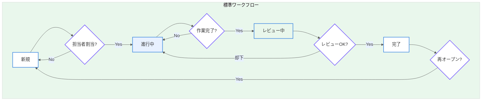
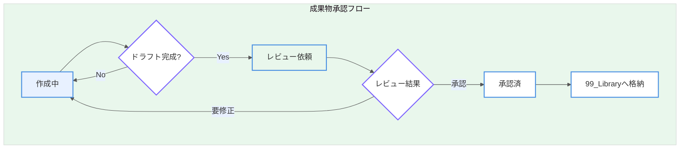

# Section 1: Redmine 初期設定・管理者ガイド

本ドキュメントは、自動運転システム（ADS）開発プロジェクトにおけるRedmine管理者向けの初期設定ガイドである。

---

## 1. プロジェクト階層設定

### 1.1 階層構造

以下の階層構造でプロジェクトを作成すること。

```
📦 ADS_Root (親プロジェクト)
├── 📂 00_SystemDesign (システム設計)
├── 📂 01_Perception (認知)
├── 📂 02_Planning (制御)
├── 📂 03_Embedded (組込)
├── 📂 04_QA (品質保証)
└── 📂 99_Library (資産管理)
```

### 1.2 各プロジェクトの役割定義

| プロジェクト | 識別子 | 役割 |
|-------------|--------|------|
| **ADS_Root** | `ads_root` | PMO管理、ロードマップ管理、全体進捗の可視化 |
| **00_SystemDesign** | `00_system_design` | 技術仕様策定、アーキテクチャ設計、迷子タスクの一時置き場 |
| **01_Perception** | `01_perception` | AI/カメラ/センサーフュージョン開発 |
| **02_Planning** | `02_planning` | 経路計画、意思決定アルゴリズム開発 |
| **03_Embedded** | `03_embedded` | ECU開発、センサードライバ、車両制御 |
| **04_QA** | `04_qa` | テスト計画、シミュレーション、品質管理 |
| **99_Library** | `99_library` | 確定した仕様書・成果物の格納（読み取り専用推奨） |

### 1.3 プロジェクト作成手順

1. 「管理」→「プロジェクト」→「新しいプロジェクト」を選択する
2. 以下の設定で親プロジェクトを作成する
   - 名称: `ADS_Root`
   - 識別子: `ads_root`
   - 説明: 「自動運転システム開発プロジェクト（親）」
   - 公開: チェックを外す（社内限定）
3. 子プロジェクトは「親プロジェクト」に `ADS_Root` を指定して作成する
4. モジュール設定で以下を有効化する
   - チケットトラッキング
   - Wiki
   - バージョン管理
   - ガントチャート

---

## 2. トラッカーとワークフロー

### 2.1 トラッカー定義

| トラッカー | レベル | 用途 | 親子関係 |
|-----------|--------|------|----------|
| **エピック** | Lv1 | 大規模な機能群・テーマ | 子にストーリーを持つ |
| **ストーリー** | Lv2 | ユーザー価値のある機能単位 | 親はエピック、子にタスクを持つ |
| **タスク** | Lv3 | 具体的な作業項目 | 親はストーリー |
| **バグ** | - | 不具合・障害 | 単独または親にストーリー |
| **成果物** | - | ドキュメント・設計書の管理 | 承認フロー付き |

### 2.2 トラッカー作成手順

1. 「管理」→「トラッカー」→「新しいトラッカー」を選択する
2. 各トラッカーを上記定義に従い作成する
3. 「デフォルトのステータス」は「新規」に設定する

### 2.3 親子関係ルール設定

「管理」→「設定」→「チケットトラッキング」で以下を設定する：

- **サブタスクを許可**: 有効
- **親チケットのトラッカー制限**:
  - エピック → ストーリー のみ許可
  - ストーリー → タスク、バグ を許可
  - タスク → 子チケット不可
  - 成果物 → 子チケット不可

### 2.4 ワークフロー設定

#### 2.4.1 標準ワークフロー（エピック/ストーリー/タスク/バグ）



| 遷移元 | 遷移先 | 条件 |
|--------|--------|------|
| 新規 | 進行中 | 担当者が割り当てられていること |
| 進行中 | レビュー中 | 作業が完了していること |
| レビュー中 | 完了 | レビュー担当者が承認 |
| レビュー中 | 進行中 | 差し戻し |
| 完了 | 新規 | 再オープン（要コメント） |

#### 2.4.2 成果物トラッカーの承認フロー



| ステータス | 説明 | 次のアクション |
|-----------|------|----------------|
| 作成中 | 担当者がドキュメント作成中 | ドラフト完成後「レビュー依頼」へ |
| レビュー依頼 | レビュー担当者の確認待ち | 承認 or 差し戻し |
| 承認済 | 正式版として確定 | 99_Libraryへ格納 |

### 2.5 ワークフロー設定手順

1. 「管理」→「ワークフロー」を選択する
2. トラッカーごとにステータス遷移を設定する
3. ロール（開発者、レビューア、マネージャー）ごとに遷移権限を設定する

---

## 3. バージョン共有設定

### 3.1 バージョン（マイルストーン）の作成

親プロジェクト（ADS_Root）でバージョンを作成し、全子プロジェクトで共有する。

#### 3.1.1 バージョン命名規則

```
v{メジャー}.{マイナー}.{パッチ}-{フェーズ}
例: v1.0.0-alpha, v1.2.0-sprint3, v2.0.0-release
```

#### 3.1.2 共有設定手順

1. `ADS_Root` プロジェクトを開く
2. 「設定」→「バージョン」→「新しいバージョン」を選択する
3. バージョン情報を入力する
   - 名称: `v1.0.0-sprint1`
   - 説明: 「Sprint 1: 基本認知機能の実装」
   - 期日: スプリント終了日
   - **共有**: 「階層全体(すべての子プロジェクトと共有)」を選択する
4. 「作成」をクリックする

### 3.2 バージョンの階層共有イメージ

```
ADS_Root (v1.0.0-sprint1を作成・共有)
├── 00_SystemDesign → v1.0.0-sprint1 が利用可能
├── 01_Perception   → v1.0.0-sprint1 が利用可能
├── 02_Planning     → v1.0.0-sprint1 が利用可能
├── 03_Embedded     → v1.0.0-sprint1 が利用可能
├── 04_QA           → v1.0.0-sprint1 が利用可能
└── 99_Library      → v1.0.0-sprint1 が利用可能
```

---

## 4. カスタムクエリ設定

### 4.1 「全プロジェクト横断・マイタスク」クエリの作成

開発者が自分の担当タスクを全プロジェクト横断で確認できるクエリを作成する。

#### 4.1.1 作成手順

1. 「チケット」画面を開く
2. 「フィルタ」で以下を設定する
   - **プロジェクト**: 「自分が参加しているプロジェクト」にチェック
   - **担当者**: 「自分」を選択
   - **ステータス**: 「未完了」を選択
3. 「オプション」で以下を設定する
   - **表示項目**: プロジェクト、トラッカー、題名、ステータス、優先度、期日
   - **ソート**: 期日（昇順）、優先度（降順）
4. 「保存」をクリックする
   - 名称: `【横断】マイタスク一覧`
   - 公開: 全員に公開（推奨）

#### 4.1.2 推奨カスタムクエリ一覧

| クエリ名 | 用途 | フィルタ条件 |
|----------|------|--------------|
| 【横断】マイタスク一覧 | 個人の担当タスク確認 | 担当者=自分、ステータス=未完了 |
| 【横断】期限切れタスク | 遅延タスクの把握 | 期日<今日、ステータス=未完了 |
| 【横断】今週の完了予定 | 週次計画の確認 | 期日=今週、ステータス=未完了 |
| 【横断】レビュー待ち | レビュー待ちの確認 | ステータス=レビュー中 |
| 【横断】バグ一覧 | バグの一元管理 | トラッカー=バグ、ステータス=未完了 |

---

## 5. 管理者チェックリスト

Redmine初期設定完了時に以下を確認すること。

- [ ] 全プロジェクト（ADS_Root + 6子プロジェクト）が作成されていること
- [ ] トラッカー（エピック/ストーリー/タスク/バグ/成果物）が作成されていること
- [ ] ワークフローが各トラッカーに設定されていること
- [ ] カスタムフィールド（Section 1.5参照）が作成されていること
- [ ] バージョン共有が「階層全体」に設定されていること
- [ ] カスタムクエリが公開設定で保存されていること
- [ ] 各プロジェクトのWikiが初期化されていること

---

*本ドキュメントは管理者向けの初期設定ガイドである。運用ルールについてはSection 2を参照すること。*
