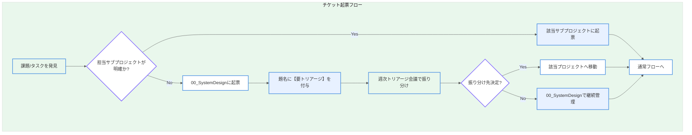
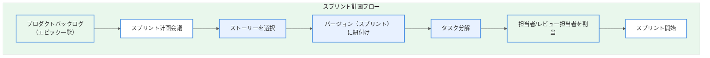
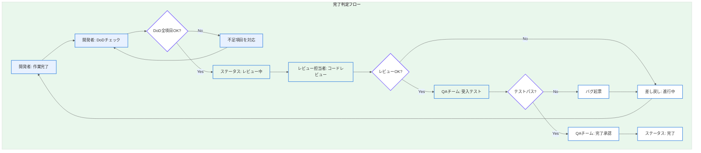

# Section 2: Redmine 運用ルール & Wikiテンプレート

本ドキュメントは、自動運転システム（ADS）開発プロジェクトにおけるRedmine運用ルールと、Wikiテンプレートを記載する。

---

## 1. 運用ルール

### 1.1 チケット起票ルール

#### 1.1.1 「迷ったら『00_SystemDesign』に起票する」ルール



**ルール詳細**:

| 条件 | 起票先 | 備考 |
|------|--------|------|
| 認知系（AI/カメラ）に関する課題 | 01_Perception | センサーフュージョン含む |
| 経路計画に関する課題 | 02_Planning | 意思決定ロジック含む |
| ECU/組込に関する課題 | 03_Embedded | HW連携含む |
| テスト/品質に関する課題 | 04_QA | シミュレーション含む |
| **上記に該当しない/不明** | **00_SystemDesign** | 【要トリアージ】タグ必須 |
| システム全体に関わる仕様 | 00_SystemDesign | アーキテクチャ変更など |

**起票時の注意事項**:

1. 題名の先頭に `【要トリアージ】` を付けること
2. 説明欄に「振り分け先の候補」を記載すること
3. トラッカーは「タスク」または「ストーリー」を選択すること

### 1.2 エピック(親)とバージョン(スプリント)の関係

#### 1.2.1 階層構造と関連性

```
エピック (Lv1)
├── ストーリー (Lv2) ─── バージョン（スプリント）に紐付け
│   ├── タスク (Lv3) ─── バージョン（スプリント）に紐付け
│   └── タスク (Lv3)
└── ストーリー (Lv2)
    └── タスク (Lv3)
```

#### 1.2.2 運用ルール

| 項目 | ルール |
|------|--------|
| エピックとバージョン | エピックは特定のバージョンに紐付けない（複数スプリントにまたがるため） |
| ストーリーとバージョン | ストーリーは必ず1つのバージョン（スプリント）に紐付けること |
| タスクとバージョン | タスクは親ストーリーと同じバージョンに紐付けること |
| バージョン期日 | バージョンの期日はスプリント終了日を設定すること |

#### 1.2.3 スプリント計画の流れ



### 1.3 QAチームによる「完了」判定のプロセス

#### 1.3.1 完了判定フロー



#### 1.3.2 完了判定の責任分担

| 役割 | 確認項目 | ステータス遷移権限 |
|------|----------|-------------------|
| 開発者 | DoD（実装タスク）の充足 | 新規→進行中→レビュー中 |
| レビュー担当者 | コード品質、設計適合性 | レビュー中→進行中（差戻） |
| QAチーム | 受入テスト、回帰テスト | レビュー中→完了 |

### 1.4 チケット更新ルール

| タイミング | 必須アクション |
|-----------|----------------|
| 作業開始時 | ステータスを「進行中」に変更、予定工数を入力 |
| 作業中断時 | コメントで中断理由を記録 |
| 日次終了時 | 作業内容をコメントで報告、進捗率を更新 |
| 作業完了時 | DoD確認、ステータスを「レビュー中」に変更 |

---

## 2. Wikiテンプレート

### 2.1 00_SystemDesign プロジェクト Wikiトップページ

以下のテンプレートを `00_SystemDesign` プロジェクトのWikiトップページに貼り付けること。

```markdown
# 📂 00_SystemDesign - システム設計

## 概要

本プロジェクトは、自動運転システム（ADS）全体のアーキテクチャ設計、技術仕様の策定、および迷子タスクの一時管理を担当する。

---

## 🏗️ 最新アーキテクチャ図

### システム全体構成


> **最終更新**: YYYY-MM-DD | **バージョン**: v1.0.0 | **承認者**: [名前]

### コンポーネント構成

| コンポーネント | 担当プロジェクト | 説明 |
|----------------|-----------------|------|
| Perception Module | 01_Perception | カメラ/LiDAR/レーダーの認知処理 |
| Planning Module | 02_Planning | 経路計画・意思決定 |
| Control Module | 03_Embedded | 車両制御ECU |
| Safety Monitor | 04_QA | 安全監視・フェイルセーフ |

---

## 📋 I/F仕様書一覧

### 内部インターフェース

| I/F名 | バージョン | 担当 | ドキュメント |
|-------|-----------|------|--------------|
| Perception→Planning | v1.2 | システム設計チーム | [[IF_Perception_Planning]] |
| Planning→Control | v1.1 | システム設計チーム | [[IF_Planning_Control]] |
| Safety Monitor I/F | v1.0 | QAチーム | [[IF_Safety_Monitor]] |

### 外部インターフェース

| I/F名 | 規格 | 担当 | ドキュメント |
|-------|------|------|--------------|
| CAN通信 | CAN FD | 組込チーム | [[IF_CAN_Specification]] |
| Ethernet通信 | Automotive Ethernet | 組込チーム | [[IF_Ethernet_Specification]] |

---

## 🔀 技術トリアージルール

### 起票先判定フローチャート

```
課題を発見
    ↓
[担当が明確?]
    ├─ Yes → 該当プロジェクトに起票
    └─ No → 00_SystemDesignに【要トリアージ】で起票
                ↓
        週次トリアージ会議で振り分け
```

### トリアージ会議

- **開催**: 毎週月曜 10:00-11:00
- **参加者**: 各サブプロジェクトリーダー、アーキテクト
- **議事録**: [[トリアージ会議_議事録]]

### 要トリアージチケット一覧

{{query(project: 00_SystemDesign, status: open, subject: ~【要トリアージ】)}}

---

## 👋 新規参画者向けガイド

### はじめに読むドキュメント

1. [[プロジェクト概要]] - ADSプロジェクトの全体像
2. [[開発環境セットアップ]] - 開発環境の構築手順
3. [[コーディング規約]] - 各言語のコーディングルール
4. [[Redmine運用ルール]] - チケット管理のルール

### オンボーディングチェックリスト

- [ ] 開発環境の構築完了
- [ ] GitLabアカウント取得・SSHキー登録
- [ ] Redmineアカウント取得・プロジェクト参加
- [ ] 各種ドキュメントの一読
- [ ] メンターとの1on1実施

### 問い合わせ先

| 内容 | 担当 | 連絡方法 |
|------|------|----------|
| 技術的な質問 | アーキテクト | Slack #ads-tech-support |
| 環境構築 | DevOps | Slack #ads-devops |
| プロジェクト管理 | PMO | Slack #ads-pmo |

---

## 📅 更新履歴

| 日付 | 更新者 | 内容 |
|------|--------|------|
| YYYY-MM-DD | [名前] | 初版作成 |

```

### 2.2 サブプロジェクト共通 Wikiテンプレート

各サブプロジェクト（01_Perception ～ 04_QA）のWikiトップページ用テンプレート。

```markdown
# 📂 [プロジェクト名] - [説明]

## 概要

[プロジェクトの目的と責任範囲を記載]

---

## 🎯 担当領域

### 機能一覧

| 機能名 | 説明 | 担当者 | 進捗 |
|--------|------|--------|------|
| [機能1] | [説明] | [担当者] | 🟡 進行中 |
| [機能2] | [説明] | [担当者] | 🟢 完了 |

### 関連リポジトリ

| リポジトリ | 用途 | URL |
|-----------|------|-----|
| [リポジトリ名] | [用途] | [GitLab URL] |

---

## 📚 ドキュメント

### 設計書

- [[機能設計書_XXX]]
- [[詳細設計書_XXX]]

### 手順書

- [[環境構築手順]]
- [[テスト実行手順]]

---

## 📊 進捗状況

### 現スプリントの状況

{{query(project: [プロジェクト識別子], version: [現スプリント], status: *)}}

### バーンダウンチャート

[ガントチャート/バーンダウンへのリンク]

---

## 👥 チームメンバー

| 役割 | 名前 | 担当領域 |
|------|------|----------|
| リーダー | [名前] | 全体統括 |
| 開発者 | [名前] | [担当機能] |

---

## 📅 更新履歴

| 日付 | 更新者 | 内容 |
|------|--------|------|
| YYYY-MM-DD | [名前] | 初版作成 |

```

---

## 3. トリアージ運用の詳細

### 3.1 週次トリアージ会議アジェンダ

```markdown
# トリアージ会議 アジェンダ

## 日時
YYYY-MM-DD 10:00-11:00

## 参加者
- アーキテクト（司会）
- 各サブプロジェクトリーダー

## アジェンダ

### 1. 前回の振り分け結果確認（5分）
- 振り分け後のチケット状況確認

### 2. 新規トリアージ対象チケットの確認（40分）
- 【要トリアージ】チケット一覧レビュー
- 各チケットの振り分け先決定

### 3. 横断課題の共有（10分）
- プロジェクト間で共有すべき技術課題
- アーキテクチャ変更の提案

### 4. 次回予定確認（5分）

## 決定事項
| チケットID | 題名 | 振り分け先 | 備考 |
|-----------|------|-----------|------|
| #XXX | [題名] | [プロジェクト] | [備考] |

```

---

*本ドキュメントはRedmine運用ルールと Wikiテンプレートの定義ガイドである。DoDについてはSection 2.5を参照すること。*
