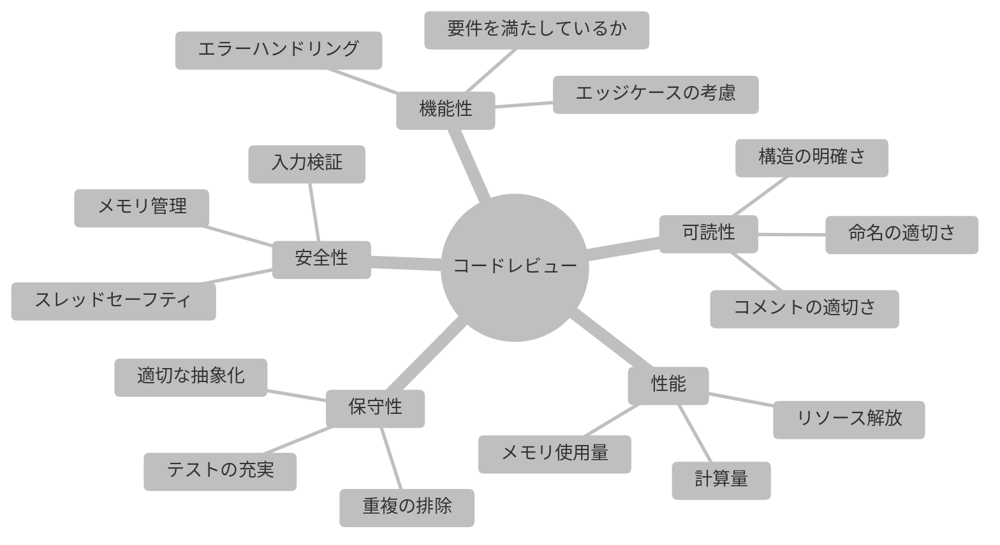

# CONTRIBUTING.md テンプレート

各リポジトリの `CONTRIBUTING.md` として使用するテンプレート。

---

## テンプレート本体

以下のMarkdownをコピーして使用すること。

---

```markdown
# 貢献ガイドライン

本ドキュメントは、[プロジェクト名]への貢献方法を定めるものである。
すべての開発者は本ガイドラインに従って作業を行うこと。

---

## 目次

1. [開発環境のセットアップ](#開発環境のセットアップ)
2. [開発フロー](#開発フロー)
3. [ブランチ命名規則](#ブランチ命名規則)
4. [コミットメッセージ規則](#コミットメッセージ規則)
5. [マージリクエスト（MR）ガイドライン](#マージリクエストmrガイドライン)
6. [コードレビュー基準](#コードレビュー基準)
7. [完了の定義（DoD）](#完了の定義dod)
8. [コーディング規約](#コーディング規約)

---

## 開発環境のセットアップ

### 必要ツール

| ツール | バージョン | 用途 |
|--------|-----------|------|
| Git | 2.30以上 | バージョン管理 |
| Git LFS | 3.0以上 | 大容量ファイル管理 |
| Docker | 20.10以上 | 開発環境コンテナ |
| [言語/ツール] | [バージョン] | [用途] |

### 初期設定

```bash
# リポジトリのクローン
git clone https://gitlab.example.com/ads/[リポジトリ名].git
cd [リポジトリ名]

# Git LFSの有効化
git lfs install

# サブモジュールの取得
git submodule update --init --recursive

# pre-commit hookの設定
./scripts/setup-hooks.sh
```

### 開発用Dockerコンテナ

```bash
# コンテナのビルド
docker build -t ads-dev:latest -f docker/Dockerfile.dev .

# コンテナの起動
docker run -it --rm \
    -v $(pwd):/workspace \
    ads-dev:latest
```

---

## 開発フロー

```mermaid
%%{init: {'theme': 'base', 'themeVariables': { 'primaryColor': '#FFFFFF', 'primaryBorderColor': '#4A90E2', 'lineColor': '#555555'}}}%%
flowchart TB
    subgraph Flow["🔄 開発フロー"]
        A["📋 1. Redmineチケット確認/作成"]
        B["🌿 2. featureブランチ作成"]
        C["💻 3. 実装・テスト"]
        D["📤 4. プッシュ"]
        E["🔀 5. MR作成"]
        F["👀 6. コードレビュー"]
        G["✅ 7. マージ"]
        H["🏁 8. チケットクローズ"]
        
        A --> B --> C --> D --> E --> F --> G --> H
    end
    
    style A fill:#E8F1FF,stroke:#4A90E2,stroke-width:2px
    style B fill:#E9F7EC,stroke:#4A90E2,stroke-width:2px
    style C fill:#FFF3E0,stroke:#4A90E2,stroke-width:2px
    style D fill:#E8F1FF,stroke:#4A90E2,stroke-width:2px
    style E fill:#E9F7EC,stroke:#4A90E2,stroke-width:2px
    style F fill:#FFF3E0,stroke:#4A90E2,stroke-width:2px
    style G fill:#FCE4EC,stroke:#4A90E2,stroke-width:2px
    style H fill:#F3E5F5,stroke:#7B61FF,stroke-width:2px
```



### 1. Redmineチケットの確認/作成

- 作業を開始する前に、必ずRedmineでチケットを確認または作成すること
- チケットには以下の情報を記載すること：
  - 目的・背景
  - 完了条件
  - 影響範囲
  - ASILレベル（該当する場合）

### 2. featureブランチの作成

```bash
# developブランチを最新化
git checkout develop
git pull origin develop

# featureブランチを作成
git checkout -b feature/[チケットID]-[機能名]
```

### 3. 実装・テスト

- コーディング規約に従って実装すること
- 単体テストを必ず追加すること
- ローカルでビルド・テストが通ることを確認すること

```bash
# ビルド
mkdir -p build && cd build
cmake .. && make -j$(nproc)

# テスト実行
ctest --output-on-failure
```

### 4. プッシュ

```bash
# 変更をコミット（コミットメッセージ規則に従う）
git add .
git commit -m "[feat] 機能説明 #123"

# リモートにプッシュ
git push origin feature/[チケットID]-[機能名]
```

### 5. マージリクエスト（MR）の作成

- GitLabでMRを作成する
- MRテンプレートに従って記載する
- レビュアーを指定する

### 6. コードレビュー

- レビュー指摘事項に対応する
- 必要に応じて再レビューを依頼する

### 7. マージ

- CI/CDパイプラインがすべて成功していることを確認する
- レビューがApproveされていることを確認する
- Squash mergeを使用する

### 8. チケットクローズ

- Redmineチケットを「完了」に更新する
- 関連ドキュメントを更新する（必要な場合）

---

## ブランチ命名規則

| 種別 | パターン | 例 |
|------|----------|-----|
| 機能開発 | `feature/[チケットID]-[機能名]` | `feature/123-object-detection` |
| バグ修正 | `bugfix/[チケットID]-[概要]` | `bugfix/456-null-pointer-fix` |
| ホットフィックス | `hotfix/[チケットID]-[概要]` | `hotfix/789-critical-crash` |
| リリース | `release/v[バージョン]` | `release/v1.2.0` |

### 命名規則

- 小文字の英数字とハイフン（`-`）のみ使用すること
- 日本語や特殊文字は使用しないこと
- 機能名は簡潔かつ説明的であること

---

## コミットメッセージ規則

### フォーマット

```
[種別] 変更内容の要約 #RedmineチケットID

詳細説明（任意）
- 変更点1
- 変更点2
```

### 種別一覧

| 種別 | 用途 | 例 |
|------|------|-----|
| `feat` | 新機能追加 | `[feat] 物体検出モジュールを追加 #123` |
| `fix` | バグ修正 | `[fix] NULLポインタ例外を修正 fixes #456` |
| `docs` | ドキュメント更新 | `[docs] API仕様書を更新 refs #789` |
| `refactor` | リファクタリング | `[refactor] 検出ロジックを整理 #101` |
| `test` | テスト追加・修正 | `[test] 境界値テストを追加 #102` |
| `chore` | ビルド・設定変更 | `[chore] CI設定を更新 #103` |
| `perf` | パフォーマンス改善 | `[perf] 推論速度を20%改善 #104` |

### Redmine連携キーワード

| キーワード | 動作 |
|-----------|------|
| `refs #ID` | チケットを参照（ステータス変更なし） |
| `fixes #ID` | チケットを「解決」に変更 |
| `closes #ID` | チケットを「終了」に変更 |

---

## マージリクエスト（MR）ガイドライン

### MRテンプレート

```markdown
## 概要
<!-- このMRで何を実現するか -->

## 関連チケット
- Redmine: #[チケットID]

## 変更内容
<!-- 変更の詳細を箇条書きで記載 -->
- 
- 
- 

## 影響範囲
<!-- 変更による影響範囲を記載 -->
- 影響を受けるモジュール: 
- 影響を受けるI/F: 

## テスト結果
<!-- テスト実施結果を記載 -->
- [ ] 単体テストをすべてパス
- [ ] 結合テストを実施（該当する場合）
- [ ] 手動テストを実施（該当する場合）

## チェックリスト
- [ ] コーディング規約に準拠している
- [ ] 必要なテストを追加した
- [ ] ドキュメントを更新した（該当する場合）
- [ ] 破壊的変更がある場合は明記した

## スクリーンショット / 動作確認
<!-- 該当する場合はスクリーンショットや動画を添付 -->
```

### MR作成時の注意事項

1. **適切なサイズ**: 1つのMRは300行以下を目安とする
2. **単一目的**: 1つのMRでは1つの機能・修正のみを扱う
3. **自己レビュー**: 提出前に自分でdiffを確認する
4. **CI確認**: パイプラインが成功してからレビュー依頼する

---

## コードレビュー基準

### レビュー観点



### レビューコメントの種類

| プレフィックス | 意味 | 対応 |
|---------------|------|------|
| `[MUST]` | 必須修正 | 対応必須 |
| `[SHOULD]` | 推奨修正 | 対応推奨 |
| `[NIT]` | 軽微な指摘 | 対応任意 |
| `[Q]` | 質問 | 回答必須 |

### レビュー時間目安

| MRサイズ | レビュー時間目安 |
|---------|----------------|
| ~100行 | 30分以内 |
| 100~300行 | 1時間以内 |
| 300行以上 | 分割を検討 |

---

## 完了の定義（DoD）

### 実装タスクのDoD

- [ ] コードがコーディング規約に準拠している
- [ ] GitLabのMRがマージされている
- [ ] 単体テストがパスしている
- [ ] 静的解析（Linter）のエラーがない
- [ ] コードカバレッジが80%以上である
- [ ] 必要なドキュメントが更新されている

### バグ修正のDoD

- [ ] 再現手順で現象が発生しないことを確認した
- [ ] 回帰テストを追加した
- [ ] 他の機能への影響（回帰）がないことを確認した
- [ ] 根本原因をチケットに記載した

### 成果物のDoD

- [ ] 成果物レビューが完了している
- [ ] 上長またはアーキテクトの承認ログがある
- [ ] 99_Libraryに格納されている（確定版の場合）

---

## コーディング規約

### C++

- [Google C++ Style Guide](https://google.github.io/styleguide/cppguide.html) に準拠
- 静的解析ツール: `clang-tidy`
- フォーマッタ: `clang-format`

```bash
# フォーマット実行
clang-format -i src/**/*.cpp src/**/*.hpp

# 静的解析実行
clang-tidy src/**/*.cpp -- -I include/
```

### Python

- [PEP 8](https://pep8.org/) に準拠
- 静的解析ツール: `flake8`, `mypy`
- フォーマッタ: `black`

```bash
# フォーマット実行
black src/

# 静的解析実行
flake8 src/
mypy src/
```

### 共通ルール

| 項目 | ルール |
|------|--------|
| インデント | スペース4つ |
| 行の長さ | 100文字以下 |
| ファイルエンコーディング | UTF-8 |
| 改行コード | LF |

---

## セキュリティガイドライン

### 禁止事項

- ハードコードされた認証情報のコミット
- 未検証の外部入力の使用
- デバッグコードの本番コミット

### 機密情報の取り扱い

```bash
# .gitignoreに追加すべきファイル
*.key
*.pem
*.env
credentials.*
secrets.*
```

---

## 問い合わせ先

| 役割 | 担当 | 連絡先 |
|------|------|--------|
| リポジトリ管理者 | [名前] | [email/Slack] |
| 技術リード | [名前] | [email/Slack] |
| レビュー依頼 | [チーム名] | [Slackチャンネル] |

---

*本ガイドラインは定期的に見直し、必要に応じて更新すること。*
```

---

*本テンプレートは各リポジトリのCONTRIBUTING.md作成時に使用すること。*
