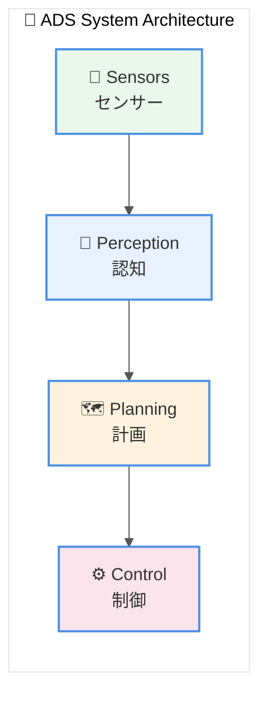
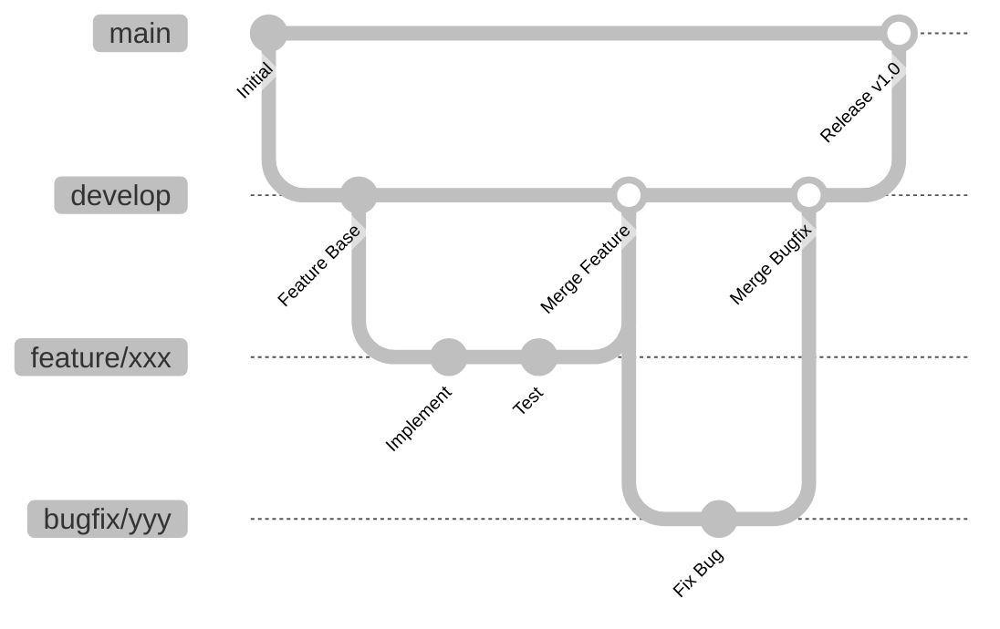
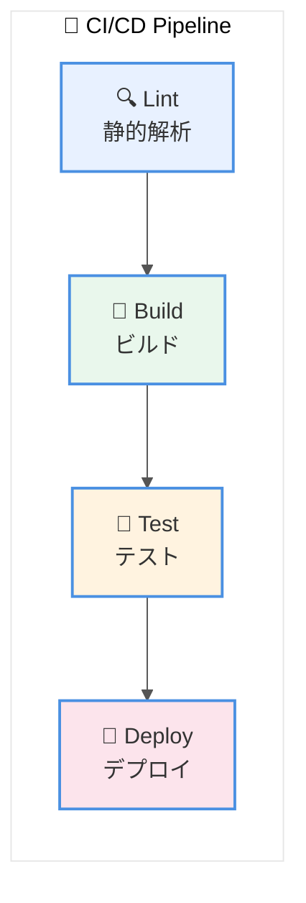

# Section 4: GitLab README.md テンプレート

各リポジトリのトップに配置する `README.md` のテンプレート。

---

## テンプレート本体

以下のMarkdownをコピーして、各リポジトリのREADME.mdとして使用すること。
`[プレースホルダー]` の部分は適宜置き換えること。

> **Note**: システムアーキテクチャ図の詳細版は [diagrams/ads_system_architecture.md](diagrams/ads_system_architecture.md) を参照すること。

---

```markdown
# [プロジェクト名]

[](https://gitlab.example.com/ads/[リポジトリ名]/-/pipelines)
[](https://gitlab.example.com/ads/[リポジトリ名]/-/jobs)

## 概要

[このリポジトリの目的と、自動運転システム（ADS）における役割を1-2段落で説明]

### 主な機能

- [機能1]: [簡潔な説明]
- [機能2]: [簡潔な説明]
- [機能3]: [簡潔な説明]

### システム構成における位置づけ

> 詳細なアーキテクチャ図は [diagrams/ads_system_architecture.md](../diagrams/ads_system_architecture.md) を参照すること。



**[本リポジトリの位置]**: 上記の `[該当モジュール名]` に該当する。

---

## 関連リンク

### Redmineプロジェクト

| プロジェクト | URL |
|-------------|-----|
| 親プロジェクト | [ADS_Root](https://redmine.example.com/projects/ads_root) |
| 本プロジェクト | [[プロジェクト名]](https://redmine.example.com/projects/[識別子]) |

### 関連リポジトリ

| リポジトリ | 説明 |
|-----------|------|
| [ads-system-design](https://gitlab.example.com/ads/ads-system-design) | システム設計・I/F仕様 |
| [ads-common](https://gitlab.example.com/ads/ads-common) | 共通ライブラリ |

---

## ドキュメント

詳細なドキュメントは `/docs` ディレクトリを参照すること。

| ドキュメント | 説明 | リンク |
|-------------|------|--------|
| アーキテクチャ設計 | モジュールの全体構成 | [docs/design/architecture/](docs/design/architecture/) |
| 詳細設計 | 各機能の詳細設計 | [docs/design/detailed/](docs/design/detailed/) |
| API仕様 | インターフェース仕様 | [docs/api/](docs/api/) |
| 環境構築ガイド | 開発環境のセットアップ | [docs/guides/setup.md](docs/guides/setup.md) |

---

## 環境構築

### 必要要件

- OS: Ubuntu 22.04 LTS
- コンパイラ: GCC 11以上 / Clang 14以上
- CMake: 3.20以上
- Python: 3.10以上（AIモジュールの場合）

### 依存パッケージ

```bash
# Ubuntu
sudo apt update
sudo apt install -y \
    build-essential \
    cmake \
    git \
    [その他の依存パッケージ]
```

### ビルド手順

```bash
# リポジトリのクローン
git clone https://gitlab.example.com/ads/[リポジトリ名].git
cd [リポジトリ名]

# サブモジュールの取得
git submodule update --init --recursive

# ビルドディレクトリの作成
mkdir build && cd build

# CMake設定
cmake .. -DCMAKE_BUILD_TYPE=Release

# ビルド
make -j$(nproc)
```

### テスト実行

```bash
# ビルドディレクトリで実行
cd build

# 単体テスト
ctest --output-on-failure

# カバレッジレポート生成（オプション）
make coverage
```

---

## ディレクトリ構成

```
.
├── src/                    # ソースコード
│   ├── main/              # メインコード
│   │   ├── cpp/           # C++ソース
│   │   ├── python/        # Pythonソース
│   │   └── include/       # ヘッダファイル
│   └── test/              # テストコード
├── docs/                   # ドキュメント
│   ├── design/            # 設計書
│   ├── api/               # API仕様
│   └── guides/            # ガイド
├── tests/                  # テストデータ
├── tools/                  # ツール
├── config/                 # 設定ファイル
├── .gitlab-ci.yml          # CI/CD設定
└── README.md               # 本ファイル
```

---

## 開発ガイドライン

### ブランチ戦略



| ブランチ | 用途 | 派生元 |
|---------|------|--------|
| `main` | 本番リリースブランチ | - |
| `develop` | 開発統合ブランチ | `main` |
| `feature/xxx` | 機能開発ブランチ | `develop` |
| `bugfix/xxx` | バグ修正ブランチ | `develop` |

### コミットメッセージ

```
[種別] 変更内容の要約 #RedmineチケットID

例:
[feat] 物体検出アルゴリズムを追加 #123
[fix] 境界値処理のバグを修正 fixes #456
[docs] API仕様書を更新 refs #789
```

| 種別 | 用途 |
|------|------|
| `feat` | 新機能追加 |
| `fix` | バグ修正 |
| `docs` | ドキュメント更新 |
| `refactor` | リファクタリング |
| `test` | テスト追加・修正 |
| `chore` | その他（ビルド設定など） |

### コーディング規約

- C++: [Google C++ Style Guide](https://google.github.io/styleguide/cppguide.html) に準拠
- Python: [PEP 8](https://pep8.org/) に準拠

---

## CI/CD パイプライン



| ステージ | 内容 | 実行条件 |
|---------|------|----------|
| lint | 静的解析 | MR作成時、develop/mainへのプッシュ時 |
| build | ビルド | MR作成時、develop/mainへのプッシュ時 |
| test | 単体テスト | MR作成時、develop/mainへのプッシュ時 |
| deploy | デプロイ | mainへのマージ時 |

---

## 貢献方法

1. 作業開始前にRedmineでチケットを確認または作成する
2. `develop`ブランチから機能ブランチを作成する
3. コードを実装し、テストを追加する
4. マージリクエスト（MR）を作成する
5. レビュー承認後、`develop`にマージする

詳細は [CONTRIBUTING.md](CONTRIBUTING.md) を参照すること。

---

## ライセンス

Copyright (c) [年] [会社名]. All rights reserved.
本リポジトリは社内専用であり、外部への公開・配布を禁止する。

---

## 連絡先

| 役割 | 担当者 | 連絡先 |
|------|--------|--------|
| リポジトリ管理者 | [名前] | [email/Slack] |
| 技術リード | [名前] | [email/Slack] |

---

## 更新履歴

| バージョン | 日付 | 変更者 | 変更内容 |
|-----------|------|--------|----------|
| v1.0.0 | YYYY-MM-DD | [名前] | 初版作成 |
```

---

## モジュール別カスタマイズ例

### 01_Perception（認知モジュール）用追加セクション

```markdown
## 機械学習モデル

### モデル管理

本リポジトリでは、機械学習モデルをGit LFSで管理する。

```bash
# Git LFSの設定
git lfs install
git lfs track "*.onnx"
git lfs track "*.pt"
git lfs track "*.pth"
```

### 利用可能なモデル

| モデル名 | 用途 | 精度 | 推論時間 |
|---------|------|------|----------|
| object_detector_v1.onnx | 物体検出 | mAP 85% | 30ms |
| lane_detector_v2.pt | 車線検出 | IoU 90% | 15ms |

### 学習データセット

学習データセットは以下の共有ストレージに格納されている。

- 社内NAS: `//nas.example.com/ads/datasets/`
- AWS S3: `s3://ads-datasets/`
```

### 03_Embedded（組込み）用追加セクション

```markdown
## ハードウェア要件

### 対応ECU

| ECU | スペック | 備考 |
|-----|---------|------|
| [ECU名] | ARM Cortex-A72, 4GB RAM | 主制御用 |

### クロスコンパイル

```bash
# クロスコンパイラの設定
export CROSS_COMPILE=aarch64-linux-gnu-

# ビルド
cmake .. -DCMAKE_TOOLCHAIN_FILE=cmake/aarch64-toolchain.cmake
make -j$(nproc)
```

### フラッシュ書き込み

```bash
# JTAGデバッガを使用
./tools/flash.sh --device=/dev/ttyUSB0 --binary=build/main.bin
```
```

---

*本テンプレートは各リポジトリのREADME.md作成時に使用すること。プロジェクト固有の情報は適宜追記すること。*
