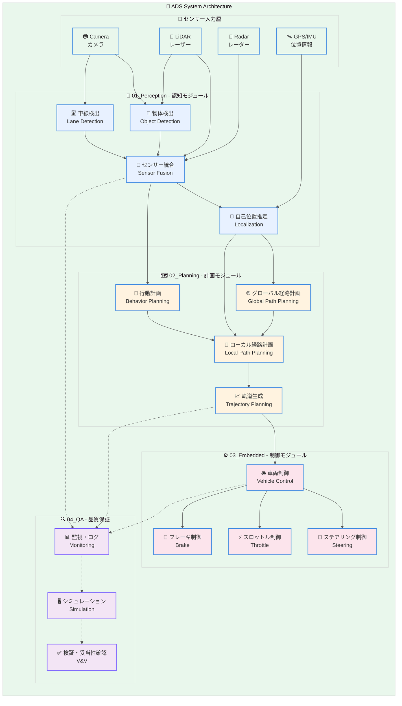
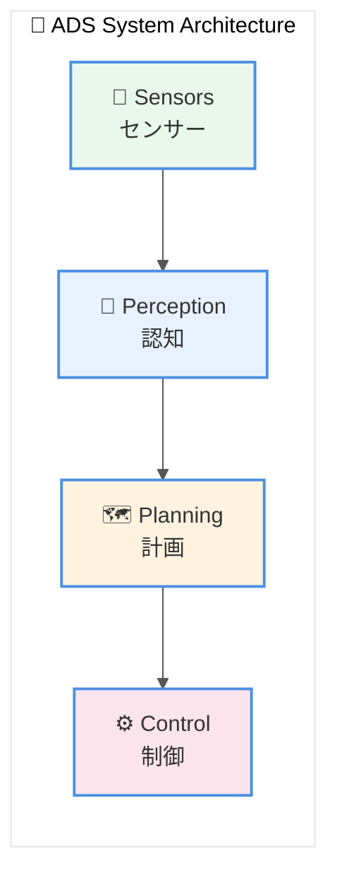
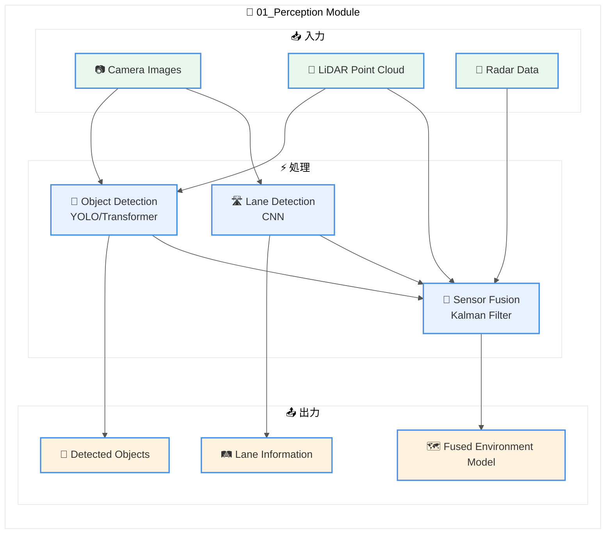

# ADS System Architecture Diagram

自動運転システム（ADS）の全体アーキテクチャを示すMermaid図。

## 使用方法

このMermaid図をREADME.mdやドキュメントに埋め込む場合は、以下のコードブロックをコピーして使用すること。

---

## アーキテクチャ図

---

## 簡易版（README埋め込み用）

リポジトリのREADME.mdに埋め込む場合は、以下の簡易版を使用すること。

---

## モジュール別詳細図

### Perceptionモジュール詳細

---

## 使用上の注意

1. **GitLabでの表示**: GitLab 15.0以降でMermaid図がネイティブサポートされている
2. **プレースホルダー**: `[本リポ]`の部分は、該当するリポジトリに合わせて強調表示を変更すること
3. **カスタマイズ**: 各モジュールの色は`classDef`で定義されているため、必要に応じて変更可能
